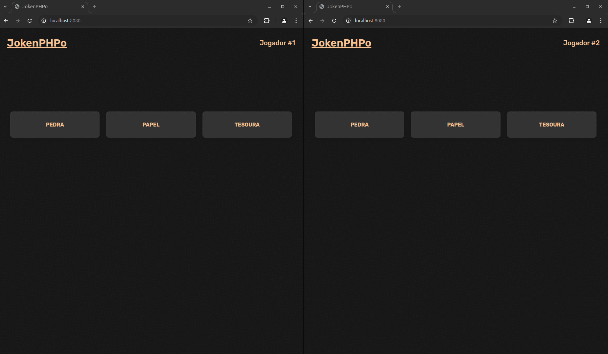

## Apresentação Geral

**Nome do Projeto:** JokenPHPo

**Descrição:**

O JokenPHPo é um jogo em tempo real de jokenpô para dois jogadores. Com uma interface simples e intuitiva, ele permite que os participantes se 
desafiem em partidas rápidas combinando nostalgia e tecnologia de forma leve e acessível.



**Objetivo:**

Implementar uma aplicação em PHP com Swoole e WebSocket para comunicação em tempo real.

**Tecnologias Utilizadas:**


## Para Desenvolvedores

Se você é um desenvolvedor interessado em contribuir ou entender melhor o funcionamento do projeto, aqui estão algumas informações adicionais:

**Ambiente:**


**Instruções de Instalação e Configuração:**

> Atenção: Obrigatório o uso de Docker em sua máquina.

1. Clone o repositório do projeto:
```
git clone https://github.com/edssaac/jokenPHPo
```

2. Navegue até o diretório do projeto:
```
cd jokenPHPo
```

3. Inicie a aplicação atráves do script que configura o Docker:
```
.ci_cd/init.sh  
```
Com isso a aplicação estará acessivel: [http://localhost:8080](http://localhost:8080)

Agora, cada jogador pode abrir uma nova janela e iniciar a partida.

---

4. Quando desejar encerrar a aplicação, use:
```
.ci_cd/stop.sh
```
Caso deseje encerrar e remover os volumes criados, use:
```
.ci_cd/stop.sh -v
```

## Contato

[](https://github.com/edssaac)
[](mailto:edssaac@gmail.com)
[](mailto:edssaac@outlook.com)
[](https://www.linkedin.com/in/edssaac)
